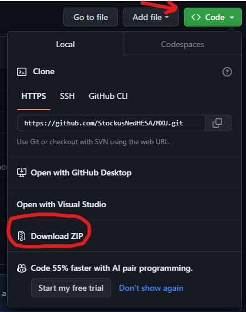
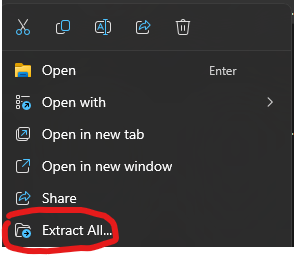
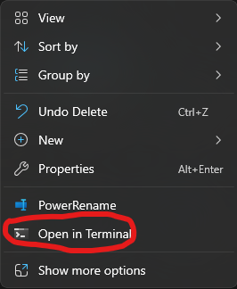

<div align="center">
  <h3 align="center">MXU</h3>
  <p align="center">
    Mass XML Updater
  </p>
</div>

## About The Project

Mass XML Updater aims to automatically update a batch of XML - modifying their properties, removing/adding fields etc.

### Getting Started

Download the latest by clicking the green **Code** button and selecting **Download ZIP**\
Afterwards, in file explorer right click the file that was downloaded and select **Extract All...**\



### Setup - Development

Ensure that **Node.js LTS** is installed via **Company Portal**!

1. Open the directory with all file content and Right Click anywhere and choose **Open Terminal**



3. Install the dependencies by entering `npm install` inside the **Terminal** (Only once)
4. Create a **start** file by **copying everything** and pasting the code below into **Terminal**

 ```bash
 $FileContent =@"
 @echo off
 call npm run MXU
 echo.
 pause
 "@

Out-File 'start.bat' -Append -Encoding Ascii
Add-content -Path "./start.bat" -Value $FileContent
```

3.1. Close the **Terminal Window**\
4. Modify the `config.jsonc` with your requirements
5. Run `start.bat`
